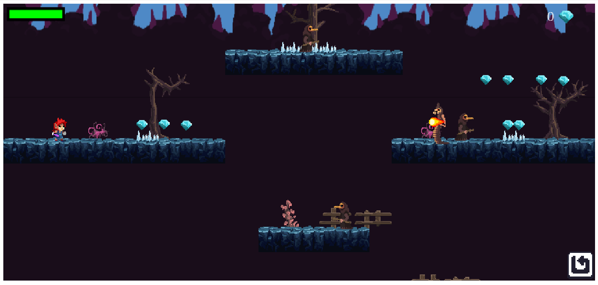

# Platform Game

[![Contributors][contributors-shield]][contributors-url]
[![Forks][forks-shield]][forks-url]
[![Stargazers][stars-shield]][stars-url]
[![Issues][issues-shield]][issues-url]

## About the project

This is a platform game which was created using Phaser library and the given assets in itch.io  .

## Setting up game on your local machine

- Make sure you have node installed.
- Clone this repository.
- Open this project in a code editor.
- Open a terminal in this directory path.
- Run `npm install` and wait for all the dependencies to install.
- To run the project in development mode, run `npm run dev`.
- Open `http://localhost:8080/` link in your browser and you should be able to play the game now.

## How to play the game

- Click on `Play` option to start the game.
- Use `right arrow` key and `left arrow` key on your keyboard to move right and left respectively.
- Press the `Q` key on your keyboard to send a projectile attack at enemies.
- Press the `E` key to attack using the weapon.
- Press the `space bar` or `UP arrow key` to jump.
- Use the `down arrow key` to duck projectile attacks.
- The user is allowed to jump twice. Once on the ground and once in mid air.

## Features

Some of the features on the game include:

- Player functions like jumping, projectile attacks and weapon attack.
- The player is supposed to get as many gems as possible.
- Enemies include birdman and snaky
- Snaky enemy has the ability to throw a projectile attack.
- There are two levels in the game

## Project specifications

- Retro music, tilesets and other assets by [Filip Jerga](https://itch.io/game-assets/free/tag-tileset)
- Project Links: [Production link](https://mk-platform-game.netlify.app/)

## Potential Future Features

- Mobile compatibility
- UI/UX

## Technologies Used

- This project utilizes the Phaser library

<!-- 

## Testing

## Test Output

-->

## Contributors

- Moin Khan
  - LinkedIn : [@MoinKhanIF](https://www.linkedin.com/in/moinkhanif/)
  - Personal Website: [MoinKhanIF.dev](https://moinkhanif.dev)
  - Twitter: [@MoinKhanIF](https://twitter.com/MoinKhanIF)
  
<!-- MARKDOWN LINKS & IMAGES -->

[contributors-shield]: https://img.shields.io/github/contributors/moinkhanif/platform-game.svg?style=flat-square
[contributors-url]: https://github.com/moinkhanif/platform-game/graphs/contributors
[forks-shield]: https://img.shields.io/github/forks/moinkhanif/platform-game.svg?style=flat-square
[forks-url]: https://github.com/moinkhanif/platform-game/network/members
[stars-shield]: https://img.shields.io/github/stars/moinkhanif/platform-game.svg?style=flat-square
[stars-url]: https://github.com/moinkhanif/platform-game/stargazers
[issues-shield]: https://img.shields.io/github/issues/moinkhanif/platform-game.svg?style=flat-square
[issues-url]: https://github.com/moinkhanif/platform-game/issues
